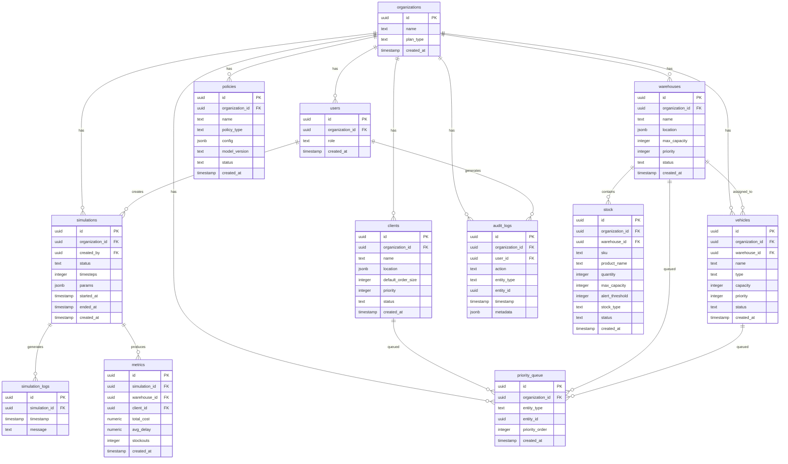

# Chainlytics Database ERD

```mermaid
erDiagram
    organizations ||--o{ users : "has"
    organizations ||--o{ warehouses : "has"
    organizations ||--o{ clients : "has"
    organizations ||--o{ vehicles : "has"
    organizations ||--o{ priority_queue : "has"
    organizations ||--o{ simulations : "has"
    organizations ||--o{ policies : "has"
    organizations ||--o{ audit_logs : "has"
    
    users ||--o{ simulations : "creates"
    users ||--o{ audit_logs : "generates"
    
    warehouses ||--o{ stock : "contains"
    warehouses ||--o{ vehicles : "assigned_to"
    
    clients ||--o{ priority_queue : "queued"
    warehouses ||--o{ priority_queue : "queued"
    vehicles ||--o{ priority_queue : "queued"
    
    simulations ||--o{ simulation_logs : "generates"
    simulations ||--o{ metrics : "produces"
    
    %% Table Definitions
    organizations {
        uuid id PK
        text name
        text plan_type
        timestamp created_at
    }
    
    users {
        uuid id PK
        uuid organization_id FK
        text role
        timestamp created_at
    }
    
    warehouses {
        uuid id PK
        uuid organization_id FK
        text name
        jsonb location
        integer max_capacity
        integer priority
        text status
        timestamp created_at
    }
    
    clients {
        uuid id PK
        uuid organization_id FK
        text name
        jsonb location
        integer default_order_size
        integer priority
        text status
        timestamp created_at
    }
    
    stock {
        uuid id PK
        uuid organization_id FK
        uuid warehouse_id FK
        text sku
        text product_name
        integer quantity
        integer max_capacity
        integer alert_threshold
        text stock_type
        text status
        timestamp created_at
    }
    
    vehicles {
        uuid id PK
        uuid organization_id FK
        uuid warehouse_id FK
        text name
        text type
        integer capacity
        integer priority
        text status
        timestamp created_at
    }
    
    priority_queue {
        uuid id PK
        uuid organization_id FK
        text entity_type
        uuid entity_id
        integer priority_order
        timestamp created_at
    }
    
    simulations {
        uuid id PK
        uuid organization_id FK
        uuid created_by FK
        text status
        integer timesteps
        jsonb params
        timestamp started_at
        timestamp ended_at
        timestamp created_at
    }
    
    simulation_logs {
        uuid id PK
        uuid simulation_id FK
        timestamp timestamp
        text message
    }
    
    policies {
        uuid id PK
        uuid organization_id FK
        text name
        text policy_type
        jsonb config
        text model_version
        text status
        timestamp created_at
    }
    
    metrics {
        uuid id PK
        uuid simulation_id FK
        uuid warehouse_id FK
        uuid client_id FK
        numeric total_cost
        numeric avg_delay
        integer stockouts
        timestamp created_at
    }
    
    audit_logs {
        uuid id PK
        uuid organization_id FK
        uuid user_id FK
        text action
        text entity_type
        uuid entity_id
        timestamp timestamp
        jsonb metadata
    }
```